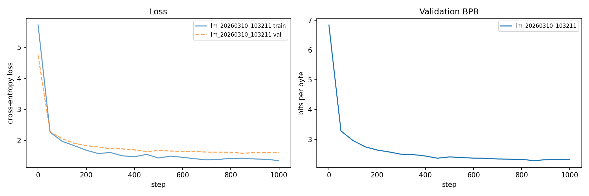
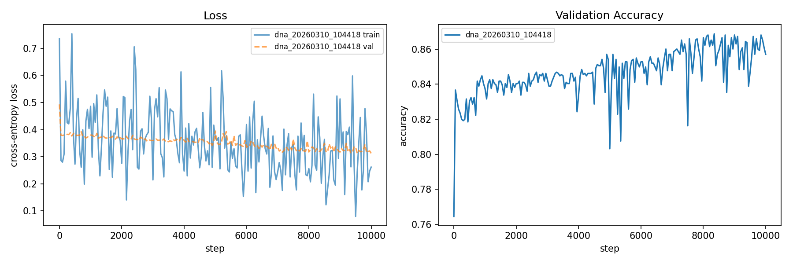
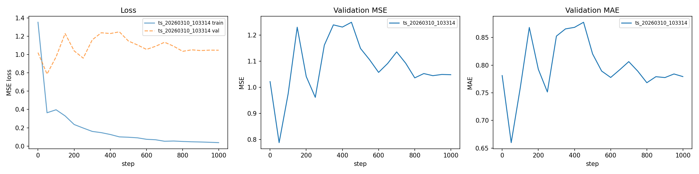
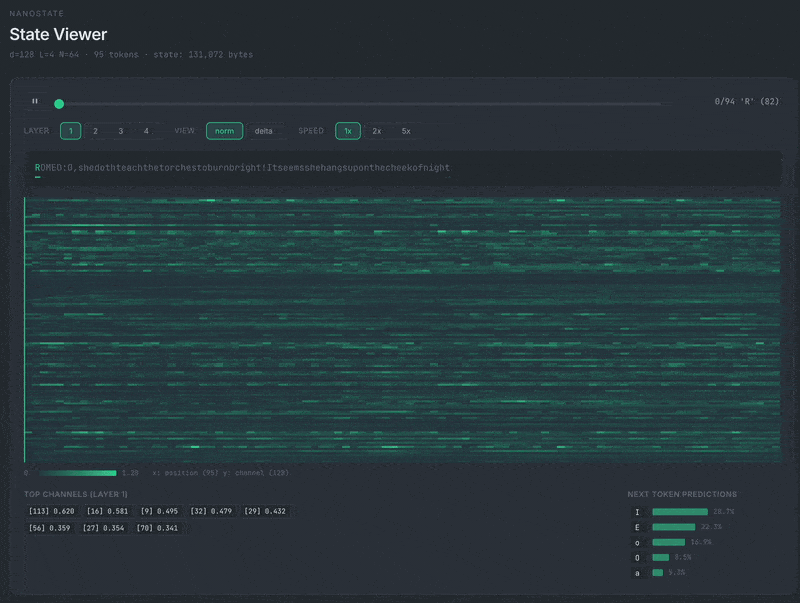

# nanostate

The [nanochat](https://github.com/karpathy/nanochat) of state space models.

Karpathy stripped GPT training down to something you can read in one sitting. We're doing the same thing for SSMs.

## Why SSMs?

Transformers scale quadratically with sequence length. Every token attends to every other token, so doubling the context 4x's the compute. The KV cache grows with every token you generate, eating memory at inference.

SSMs don't have this problem. They compress the entire history into a fixed-size state vector, so inference cost stays constant regardless of how long the sequence gets. Training can be parallelized as a convolution. You get three views of the same model (continuous, recurrent, convolutional) and can pick whichever one fits: convolutional for fast parallel training, recurrent for cheap autoregressive generation.

The tradeoff is real: a fixed-size state can't do arbitrary lookback the way attention can. But the research keeps closing that gap (Mamba, Mamba-2, hybrid architectures), and for many tasks the linear scaling wins outright.

## The idea

Start with a minimal state space model. Diagonal S4D, random init, gated blocks. ~100 lines for the core. You can hold the whole thing in your head.

Then make it better.

**The starting point:**
- Diagonal State Space layers (S4D)
- Mamba-style SiLU gated blocks (pre-norm)
- Cosine LR decay with linear warmup
- HiPPO-LegS initialization (principled A matrix + matched dt range)

This runs on an M1 Max. Basically a potato by modern ML standards. That's the whole compute budget, and part of the appeal: SSMs let you train something meaningful on hardware that would make a GPU cluster laugh.

## Leaderboard

Language modeling on TinyShakespeare (byte-level), M1 Max. Lower BPB is better. The autoresearch agent runs experiments autonomously; each row is a commit.

| # | val_bpb | Params | Key change | Commit |
|---|---------|--------|------------|--------|
| 1 | 2.3249 | 431K | baseline (d=128, L=4, N=64) | `33f65fd` |
| 2 | 2.3031 | 431K | pre-norm residual blocks | `da90ca7` |
| 3 | 2.2390 | 2.9M | scale to d=384, L=4 | `da90ca7` |
| 4 | 2.2524 | 4.3M | Mamba-style SiLU gated block | `8ebefd9` |
| 5 | 2.2225 | 4.3M | lr=5e-4 | `ffc50ee` |
| 6 | 2.2093 | 4.3M | cosine LR decay + warmup | `7bbf711` |
| 7 | 2.1838 | 4.3M | HiPPO-LegS initialization | `ea2016b` |
| 8 | **2.1745** | **4.3M** | **lr=7e-4** | `6a6c03f` |

*37 experiments across two autoresearch runs ([details](#all-experiments)).*

<details>
<summary><a id="all-experiments"></a>All experiments (including discards)</summary>

| val_bpb | Params | Status | Description | Commit |
|---------|--------|--------|-------------|--------|
| 2.3249 | 431K | keep | baseline | `33f65fd` |
| 2.3449 | 431K | discard | S4D-Lin complex + ZOH + pre-norm (all at once) | `c2945c0` |
| 2.5308 | 431K | discard | dt init [0.001,0.1] only | `8945d00` |
| 2.3031 | 431K | keep | pre-norm residual blocks | `da90ca7` |
| 2.4070 | 431K | discard | HiPPO A init only (dt=1.0 kills most states) | `66185fb` |
| 2.4647 | 431K | discard | HiPPO A + dt [0.001,0.1] paired | `6f0be69` |
| 2.2945 | 2.0M | keep | d=256, n_layers=6 | `da90ca7` |
| 2.3574 | 2.6M | discard | d=256, n_layers=8, lr=3e-4 (underfit) | `da90ca7` |
| 2.2390 | 2.9M | keep | d=384, n_layers=4 | `da90ca7` |
| 2.2555 | 4.9M | discard | d=512, n_layers=4 (diminishing returns) | `da90ca7` |
| 2.2718 | 4.2M | discard | d=384, n_layers=6 (underfits at 1000 steps) | `da90ca7` |
| 2.3776 | 2.9M | discard | 2000 steps (overfits) | `0225b51` |
| 2.2665 | 2.9M | discard | AdamW weight_decay=0.1 | `5a53028` |
| 2.2524 | 4.3M | keep | Mamba-style SiLU gated block | `8ebefd9` |
| 2.3051 | 4.3M | discard | seq_len=512 (overfits, 2x slower) | `8ebefd9` |
| 2.2225 | 4.3M | keep | lr=5e-4 | `ffc50ee` |
| 2.2541 | 4.3M | discard | lr=3e-4 (too slow at 1000 steps) | `ffc50ee` |
| 2.2617 | 4.3M | discard | output proj scaling + grad clip | `15559a0` |
| 2.2728 | 3.9M | discard | state_dim=16 | `27d609c` |
| 2.2093 | 4.3M | keep | cosine LR decay + 100-step warmup | `7bbf711` |
| 2.1838 | 4.3M | keep | HiPPO-LegS A+B init (mar11 baseline) | `ea2016b` |
| 2.1889 | 4.4M | discard | depthwise conv1d(k=4) + SiLU before SSM | `8b65172` |
| 2.2289 | 4.3M | discard | embed scaling sqrt(d_model) | `844e924` |
| 2.2267 | 4.3M | discard | dropout=0.1 after gating | `afa5eb1` |
| 2.1745 | 4.3M | keep | lr=7e-4 | `6a6c03f` |
| 2.1776 | 4.3M | discard | lr=8e-4 | `ea2016b` |
| 2.1884 | 4.3M | discard | lr=1e-3 | `ea2016b` |

**lm-tok (FineWebEdu BPE, 50K vocab)**

| val_bpb | Params | Status | Description | Commit |
|---------|--------|--------|-------------|--------|
| 8.0317 | 42.8M | keep | baseline lm-tok (d=384, L=4, 1000 steps) | `6a6c03f` |
| 8.1958 | 27.8M | discard | d=256 | `6a6c03f` |
| 8.5324 | 13.5M | discard | d=128 (too small for 50K vocab) | `6a6c03f` |
| 8.3892 | 42.8M | discard | batch=16 (fewer tokens seen) | `6a6c03f` |
| 8.1799 | 23.4M | discard | weight tying embed/head | `5710b41` |
| 7.4744 | 42.8M | keep | 3000 steps (24.6M tokens seen) | `6a6c03f` |
| 7.5317 | 23.4M | discard | weight tying + 3000 steps | `77b9f30` |
| 7.4754 | 44.9M | discard | L=6, 3000 steps (same as L=4) | `342c455` |
| 7.5124 | 42.8M | discard | lr=1e-3, 3000 steps | `342c455` |

</details>

### Baseline plots

15K steps on M1 Max, no tuning, random init. These are intentionally bad. That's the point.

**Language modeling** (byte-level Shakespeare, 431K params)



**DNA classification** (promoter detection, 366K params)



**Time series forecasting** (ETT-h1, 367K params)



## Getting started

```bash
git clone https://github.com/abhay/nanostate.git
cd nanostate
uv sync
uv run python train.py                  # byte-level LM on TinyShakespeare (fast, ~80s)
uv run python train.py --task lm-tok    # BPE token-level LM on FineWebEdu (real benchmark)
uv run python train.py --task dna       # DNA classification
uv run python train.py --task ts        # time series forecasting
```

Or reproduce the current best result in one shot:

```bash
bash runs/speedrun.sh    # ~2.17 val_bpb in 84s on M1 Max
```

## Model sizes

One flag to scale the model up or down. Default is `small`.

```bash
uv run python train.py --size tiny     # d=128, L=4   |    662K params | ~30s
uv run python train.py --size small    # d=384, L=4   |   4.3M params | ~80s (default)
uv run python train.py --size medium   # d=768, L=6   |  23.4M params
uv run python train.py --size large    # d=1024, L=12 |  80.9M params
```

For lm-tok, the 50K vocab embedding adds significant overhead (e.g. `small` = 42.8M params, `large` = 183M). The `NS_*` env vars override any preset for fine-grained control.

## Generation

Train a model, then generate text from it. Runs in recurrent mode: constant memory, constant cost per token. No KV cache.

```bash
# Train and save a checkpoint
uv run python train.py --task lm --save checkpoints/lm

# Generate text
uv run python generate.py checkpoints/lm --prompt "ROMEO: " --tokens 500

# Greedy decoding
uv run python generate.py checkpoints/lm --temp 0 --tokens 200

# Adjust sampling
uv run python generate.py checkpoints/lm --temp 0.7 --top-k 20 --tokens 1000
```

The inference state is a fixed-size vector (d_inner x state_dim x n_layers x 4 bytes). For the default model that's 768KB. Generating the millionth token costs the same as the first.

## Inference benchmark

Measure tokens/sec at different context depths to prove the SSM advantage: constant cost per token.

```bash
uv run python benchmark.py checkpoints/lm
```

```
After      0 tokens of context: 1,071 tok/s
After  1,000 tokens of context: 1,133 tok/s
After 10,000 tokens of context: 1,118 tok/s
```

A transformer's KV cache would use ~117 MB at 10K tokens. The SSM state is always 768 KB.

## Infinite context

Stream an entire book through the model with constant memory. Then generate a continuation from the final state.

```bash
uv run python infinite_context.py checkpoints/lm --file data/shakespeare.txt --generate 200
```

The state vector never grows — processing token 1,000,000 costs the same as token 1.

## Evaluation

Evaluate a checkpoint on its validation set or run standardized benchmarks. Prints results as JSON.

```bash
# Validation loss
uv run python eval.py checkpoints/lm
uv run python eval.py checkpoints/lm_tok --steps 50 --batch 64

# Standardized benchmarks (auto-downloads data on first run)
uv run python eval.py checkpoints/lm_tok --benchmark hellaswag
uv run python eval.py checkpoints/lm_tok --benchmark piqa
```

## State visualization

Watch what the model "remembers" as it reads text. Generates an interactive HTML heatmap of the hidden state (something only SSMs can do, since transformers have no fixed state to inspect).



```bash
# Visualize state for a text string
uv run python visualize.py checkpoints/lm "To be, or not to be, that is the question"

# From a file (first 500 chars)
uv run python visualize.py checkpoints/lm --file data/shakespeare.txt --max-chars 500

# Custom output path
uv run python visualize.py checkpoints/lm "Hello world" -o reports/state.html
```

The viewer shows state magnitude per channel as a heatmap, with layer toggle, norm/delta views, play/pause animation, and next-token predictions. Open the generated HTML in any browser.

## References

If you're new to SSMs, these are worth your time (roughly in order of accessibility):

- [A Visual Guide to Mamba and State Space Models](https://maartengrootendorst.com/blog/mamba/) by Maarten Grootendorst. 50+ figures walking you from "what's wrong with Transformers" through SSM fundamentals to Mamba's selective scan. Probably the easiest on-ramp.
- [The Annotated S4](https://srush.github.io/annotated-s4/) by Sasha Rush and Sidd Karamcheti. Line-by-line reimplementation in JAX, in the spirit of "The Annotated Transformer." This is where the math clicks.
- [Hazy Research blog series on S4](https://hazyresearch.stanford.edu/blog/2022-01-14-s4-1) by Gu, Goel, Saab, Re. The official companion posts from Stanford. Covers the three representations (continuous, recurrent, convolutional) with good intuition.
- [Introduction to State Space Models](https://huggingface.co/blog/lbourdois/get-on-the-ssm-train) by Loick Bourdois on Hugging Face. Self-contained tutorial covering discretization, HiPPO, and the three views.

The papers:

- [Efficiently Modeling Long Sequences with Structured State Spaces](https://arxiv.org/abs/2111.00396) (S4, Gu et al. 2021). The one that started it all.
- [Mamba: Linear-Time Sequence Modeling with Selective State Spaces](https://arxiv.org/abs/2312.00752) (Gu, Dao 2023). Input-dependent parameters and hardware-aware parallel scan. Mamba-3B matches Transformers at 2x the size.
- [Albert Gu's PhD thesis](https://purl.stanford.edu/mb976vf9362) (Stanford 2023). The most complete single-document treatment of the whole SSM line of work, from HiPPO through S4 and beyond.

## Acknowledgements

This project wouldn't exist without [Andrej Karpathy](https://github.com/karpathy)'s work on [nanochat](https://github.com/karpathy/nanochat) and [autoresearch](https://github.com/karpathy/autoresearch). The whole philosophy here (minimal code, obvious architecture, train it yourself) is borrowed directly from that lineage.

We also ported autoresearch's training setup to run natively on Apple Silicon via MLX: [PR](https://github.com/abhay/autoresearch/pull/2) and [branch](https://github.com/abhay/autoresearch/tree/feature/mlx). Got val_bpb down to 1.311 on an M1 Max in 5 minutes. That work is what got us thinking about SSMs on consumer hardware in the first place.

## License

MIT
